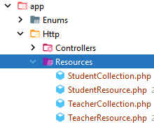

# Nombre del Proyecto: API de Gestión de Profesores y Alumnos

## Descripción
Este proyecto consiste en el desarrollo de una **API utilizando Laravel** que gestiona información de profesores y alumnos. 
En sí mismo es una explicación a la vez que un   proceso de creación de la aplicación.

La API permite crear, leer, actualizar y eliminar datos de estas entidades a través de endpoints definidos. 

Este proyecto incluye autenticación de usuarios para asegurar el acceso a la API.
A su vez, estableceremos roles **admin, profesor, alumno (resto)** para realizar gestiones permitidas que especificaremos en el apartado correspondiente *(pe. **alumno** puede ver **profesores**, pero no crearlos)*
## Objetivos
- Proporcionar una base práctica para entender la creación de APIs con Laravel.
- Implementar autenticación segura mediante tokens.
- Facilitar el manejo de relaciones entre entidades en una base de datos.

## Requisitos Previos
- PHP >= 8.2
- Composer
- MySQL o cualquier sistema de gestión de base de datos compatible con Laravel
- Node.js y NPM (opcional, para el manejo de dependencias front-end)
- Docker (dockerizaremos la base de datos mysql y phpmyadmin)

## Instalación
Se crea un proyecto nuevo **sin seleccionar ningún paquete de autenticación**, (es objetivo de este proyecto). El resto de opciones por defecto
````bash
larvel new ApiLogin
````
Para la gestión de datos, usaré ***Mysql***. Te puedes sentir libre de usar otro gestor, pero en tal caso, actualiza el docker.
### Crear el proyecto
```bash
laravel new ApiLogin

```
#### La base de datos
##### El fichero .env
Al usar docker, estableceré en el fichero **.env** las variables y sus valores.


##### Fichero de docker docker-compose.yaml

Configurar la base de datos
Modificar el archivo .env para configurar la base de datos utilizando MySQL o cualquier otra base de datos preferida:

plaintext
Copiar código
DB_CONNECTION=mysql
DB_HOST=127.0.0.1
DB_PORT=3306
DB_DATABASE=nombre_de_tu_base_de_datos
DB_USERNAME=tu_usuario
DB_PASSWORD=tu_contraseña
Migraciones y Seeders
Ejecutar migraciones y seeders para preparar la base de datos:

bash
Copiar código
php artisan migrate:fresh --seed
Estructura del Proyecto
Modelos
Student: Representa a los alumnos.
Teacher: Representa a los profesores.
Controladores
APIs para gestionar profesores y alumnos.

Migraciones
Definiciones de estructuras de tablas para la base de datos.

Seeders y Factories
Datos de prueba para población inicial de la base de datos.

Uso
Iniciar el servidor de desarrollo
bash
Copiar código
php artisan serve
Endpoints
Los endpoints para acceder a los recursos de alumnos y profesores serán accesibles vía:

/api/students para operaciones sobre alumnos.
/api/teachers para operaciones sobre profesores.
Autenticación
Describir el proceso para obtener tokens y acceder a los endpoints seguros.

Contribución
Guías para contribuir al proyecto, incluyendo estándares de código, pruebas y procesos de revisión de código.

Licencia
Especificar la licencia bajo la cual se distribuye el proyecto.

Contacto
Información de contacto del desarrollador o del equipo del proyecto.


## Creamos un api de profesores y alumnos

Para el ejemplo vamos a ofrecer datos de profesores y alumnos, dos tablas relacionadas con una cardinalidad **1:N**


## Creando el ecosistema

1. Creamos las clases (modelos, controladores de api, migraciones, factory y seeder )
````shell
  php artisan make:model Student --api -fms
  php artisan make:model Teacher --api -fms
````

2. Creamos las tablas y las poblamos
    2.1 Creamos las tablas
* **students**
> [migracion students](database/migrations/2024_05_25_061331_create_students_table.php)

* **teachers**
> [migracion teachers](database/migrations/2024_05_25_061325_create_teachers_table.php)

* Creamos una **enumeración** para validar los datos del departamento de un profesor
> [validación departamento](app/Enums/DepartmentEnum.php)
> 
* Los factorys
> [Poblando alumnos](database/factories/StudentFactory.php)
> [Poblando profesores](database/factories/TeacherFactory.php)

3. El modelo
Establecemos en el modelo las relaciones e indicamos los campos fillable
> [Modelo Student](app/Models/Student.php)
> [Modelo Teacher](app/Models/Teacher.php)
4.- El Api

Creamos un api para entregar datos usando la especificación  ***Json:Api Spec*** (https://jsonapi.org/)

Para la representacion de los recursos (Students y Teachers), creamos las clases Resources y Collection  para cada uno de ellos
````shell
 php artisan make:resource TeacherResource  
 php artisan make:resource TeacherCollection --collection 
 php artisan make:resource StudentResource  
 php artisan make:resource StudentCollection --collection 
 ````
* Nos los habrá creado en su carpeta [Carpeta de resources](app/Http/Resources)


## Creando las rutas
En la versión 11 de laravel, el API no viene configurado por defecto, ya que en el intento de quitar estructura de directorio, parte de la idea de que no vamos, por defecto, a desarrollar un api.
Para tener la confugración base (la estructura **api.php** en nuestro ***router***), debemos especificarlo:
````shell
php artisan install:api
````

Este comando nos creará el fichero [api.php](/routes/api.php) he instalará el paquete **sactum** para la autenticación basada en tokens que en un apartado posterior luego implementaremos.

Nos pide ejecutar unas migraciones que ha creado,relacionados con la atenticación   con sactum para almacenar los tokens que podemos ejecutar.
Podemos volver a cargar todas las migraciones y población desde el principio.
````shell
php artisan migrate:fresh --seed
````
Establecemos las rutas API de tipo resoruces en el fichero [api.php](/routes/api.php)
````php
Route::resource("students", \App\Http\Controllers\StudentController::class);
Route::resource("teachers", \App\Http\Controllers\StudentController::class);
````


## Especificando la representación del recurso
Un concepto es el recuros que queremos ofrecer desde nuestra API (en este caso teacher/s o student/s) , y otro concepto totalmente relacionado es la respresentación que vamos a dar a dicho recurso en un json. Vamos a seguir el formato quenos ofrece API:JSON Spect:


## Login
Para realizar la autenticación usaremos Sanctum

Sigo la doc de **Laravel**
 https://laravel.com/docs/11.x/sanctum#spa-authentication


