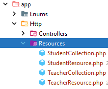

## Creamos un api de profesores y alumnos

Para el ejemplo vamos a ofrecer datos de profesores y alumnos, dos tablas relacionadas con una cardinalidad **1:N**


## Creando el ecosistema

1. Creamos las clases (modelos, controladores de api, migraciones, factory y seeder )
````shell
  php artisan make:model Student --api -fms
  php artisan make:model Teacher --api -fms
````

2. Creamos las tablas y las poblamos
    2.1 Creamos las tablas
* **students**
> [migracion students](database/migrations/2024_05_25_061331_create_students_table.php)

* **teachers**
> [migracion teachers](database/migrations/2024_05_25_061325_create_teachers_table.php)

* Creamos una **enumeración** para validar los datos del departamento de un profesor
> [validación departamento](app/Enums/DepartmentEnum.php)
> 
* Los factorys
> [Poblando alumnos](database/factories/StudentFactory.php)
> [Poblando profesores](database/factories/TeacherFactory.php)

3. El modelo
Establecemos en el modelo las relaciones e indicamos los campos fillable
> [Modelo Student](app/Models/Student.php)
> [Modelo Teacher](app/Models/Teacher.php)
4.- El Api

Creamos un api para entregar datos usando la especificación  ***Json:Api Spec*** (https://jsonapi.org/)

Para la representacion de los recursos (Students y Teachers), creamos las clases Resources y Collection  para cada uno de ellos
````shell
 php artisan make:resource TeacherResource  
 php artisan make:resource TeacherCollection --collection 
 php artisan make:resource StudentResource  
 php artisan make:resource StudentCollection --collection 
 ````
* Nos los habrá creado en su carpeta [Carpeta de resources](app/Http/Resources)


## Creando las rutas
En la versión 11 de laravel, el API no viene configurado por defecto, ya que en el intento de quitar estructura de directorio, parte de la idea de que no vamos, por defecto, a desarrollar un api.
Para tener la confugración base (la estructura **api.php** en nuestro ***router***), debemos especificarlo:
````shell
php artisan install:api
````

Este comando nos creará el fichero [api.php](/routes/api.php) he instalará el paquete **sactum** para la autenticación basada en tokens que en un apartado posterior luego implementaremos.

Nos pide ejecutar unas migraciones que ha creado,relacionados con la atenticación   con sactum para almacenar los tokens que podemos ejecutar.
Podemos volver a cargar todas las migraciones y población desde el principio.
````shell
php artisan migrate:fresh --seed
````
Establecemos las rutas API de tipo resoruces en el fichero [api.php](/routes/api.php)
````php
Route::resource("students", \App\Http\Controllers\StudentController::class);
Route::resource("teachers", \App\Http\Controllers\StudentController::class);
````


## Especificando la representación del recurso
Un concepto es el recuros que queremos ofrecer desde nuestra API (en este caso teacher/s o student/s) , y otro concepto totalmente relacionado es la respresentación que vamos a dar a dicho recurso en un json. Vamos a seguir el formato quenos ofrece API:JSON Spect:


